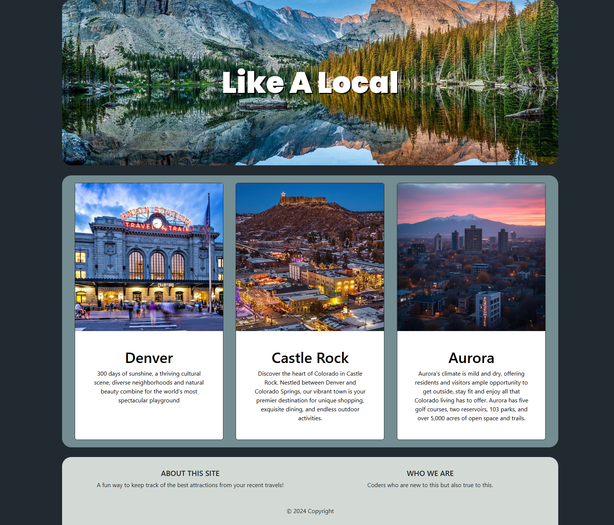

# like-a-local
Like A Local is a review-inspired website where you can submit blog entries to save your favorite spots in a new city. Sometimes when you go to public review sites, there are entries that don't capture the honest essence of a venue, so this site allows you to save your own accounts in a private place. 

On the home page you can select the city you're writing about and then once you're on that page, you can input your username, the name of attraction you visited, if it was indoor/outdoor, the type of venue it was and a paragraph about your visit. Then when you hit 'click to submit', it will ask if you're sure you want to submit as an extra buffer before it adds your entry to the page. 

In the future, we hope to make the website public so others can see reviews. We also would love for users to be able to upload their own pictures of the venues so they can save specific memories. 

Link to Deployment: 